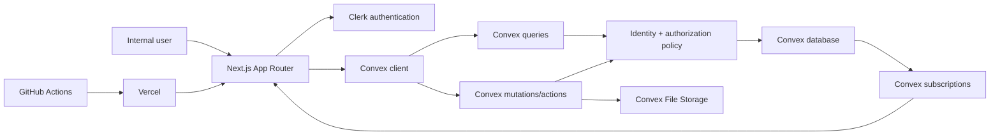

# Architecture

## Scope and principles

Purchasing Hub is a small internal system, but its purchasing and audit records require strong boundaries. The architecture uses one Next.js application for presentation and routing, Clerk for authentication, and Convex as the sole business backend, data store, real-time service, and initial file store. Fewer than 50 users makes operational clarity more valuable than premature distribution.

Core principles:

1. Convex is the authorization boundary; React visibility is never authorization.
2. Every protected operation resolves the Clerk identity to a server-controlled active user.
3. State changes use named domain commands and controlled transition functions, not general updates.
4. Sensitive/material actions create append-only audit events in the same mutation where possible.
5. Money uses integer minor units; timestamps are UTC epoch milliseconds with explicit display timezones.
6. Important records are archived/deactivated, not destructively deleted.

## System boundaries

- **Next.js:** server-rendered shell, routes, accessible UI, and Clerk/Convex providers. It does not become a second business API.
- **Clerk:** invitation-only sign-in and session identity. Public sign-up routes are absent/disabled.
- **Convex:** authoritative records, queries, transactional mutations, actions for bounded external work, subscriptions, and files.
- **GitHub/Vercel:** source/CI and deployment. Environment values remain in service secret stores.

## Request and mutation flow

1. Clerk authenticates the browser and provides a signed identity token.
2. The Convex function obtains identity from its execution context; it never accepts identity or role as authoritative arguments.
3. A centralized resolver maps Clerk user ID to an active `users` record and computes capabilities from the server-stored role.
4. A query applies record-level scope before fetching/returning data. A mutation validates arguments, checks capability and current entity state, performs a named transition, and appends audit data.
5. Response DTOs are shaped to the caller. Ordinary callers never receive hidden role values, Overlord identity, unrestricted storage IDs, or internal-only notes.
6. Subscriptions automatically refresh authorized projections. Authorization is reevaluated each time the query runs.

## Authentication and authorization

Clerk verifies identity; Convex decides access. The user mapping is keyed by Clerk user ID and preserves historical attribution when deactivated. Missing, uninvited, or inactive mappings fail closed. Client-supplied roles, requester IDs, assignment IDs, and ownership assertions are treated only as untrusted input.

Authorization helpers should separate:

- `requireIdentity` and `requireActiveUser`;
- capability checks such as `requirePermission("order.claim")`;
- record-scope checks such as `canReadOrder`;
- concealed management projections that exclude protected principals;
- transition guards that combine role, state, ownership, and prerequisites.

Visible roles are requester, receptionist, purchasing agent, admin, and super admin. Overlord capabilities supersede all permissions but are resolved only on the server.

## Overlord bootstrap and concealment

`OVERLORD_CLERK_USER_ID` is a protected Convex deployment value containing the initial Clerk user ID. On authenticated access, server code compares the verified identity to this value and maintains/recognizes a protected principal. No seed file, browser variable, ordinary role table response, role selector, filter, export, or client bundle contains `overlord`.

Only an authenticated Overlord can manage protected owner configuration through dedicated server functions and an Overlord-only control surface. Ordinary admin and super-admin user queries exclude protected records before pagination/counting to prevent inference. Direct-ID reads and mutations also apply concealment. Non-Overlord audit projections replace the actor with `System Administrator`; the immutable event retains the protected actor ID and true identity is returned only to an Overlord.

Bootstrap rotation/recovery is an operational procedure: update the protected deployment value, validate the new Clerk identity, execute an audited protected reconciliation, and retain historical attribution. Phase 1 must decide and document the precise recovery runbook before production use.

## Real-time behavior and prioritization

Convex subscriptions power My Orders, the purchasing bucket, details, comments, status, and notifications. Bucket queries use bounded indexed reads and deterministic server sorting:

1. overdue active orders;
2. nearest required time;
3. approved urgent/late exceptions;
4. unassigned orders;
5. remaining active orders by required time.

A stable order-number/ID tie-breaker prevents row movement for equal priority. Claiming is one atomic mutation that checks `assignedAgentId` is absent before writing assignment history and audit events; concurrent attempts cannot both succeed.

## File storage

Uploads use a two-step authorized flow: validate intended purpose and metadata, issue a short-lived upload URL, then finalize only after server checks of caller, association, declared/observed type, and size. Application records reference storage IDs internally. Downloads pass through an authorized query/action that returns short-lived access only after record-level checks. Orphan cleanup, retention, malware-scanning options, and final size/type allowlists are Phase 1/2 decisions.

Receipt proof is retained with its purchase history. Replacing a file archives/supersedes metadata rather than erasing audit linkage. Logs must not include full signed URLs.

## Deployment and environments

Development, preview, and production use separate Clerk instances/configuration, Convex deployments, Vercel environment values, and Overlord bootstrap identities. GitHub is the source of truth. Pull requests run checks; approved `main` is the production deployment source. Preview deployments must not share production credentials or data.

Expected deployment flow:

1. branch and pull request;
2. GitHub Actions: install, format, lint, types, tests, build;
3. human approval and merge to `main`;
4. Vercel build using environment-scoped values;
5. Convex deployment/schema compatibility check and smoke verification;
6. rollback by redeploying a known-good commit, with forward-compatible data changes.

## Failure and consistency strategy

- Domain writes and their audit event occur in the same Convex mutation whenever possible.
- External side effects use idempotency/deduplication keys and record pending/success/failure state.
- Users receive current-state conflict errors for stale edits, claims, and transitions.
- Derived order status is recalculated/validated from item states inside mutations.
- Queries remain bounded and indexed; report/export work uses server-authorized batching.

## Assumptions and decisions deferred

- One organization/tenant is assumed for release one; department/location provide internal segmentation, not tenant security.
- One currency is stored per estimate/transaction, but no cross-currency total is computed without an approved exchange-rate policy.
- Continuous calendar lead time includes weekends and holidays.
- Category lists, budget rules/thresholds, automatic allocation use, final post-purchase cancellation authority, edit cutoffs, external notifications, and PDF reports remain configurable or future decisions.
- Clerk, Convex, Vercel, and CI are not configured in Phase 0.

