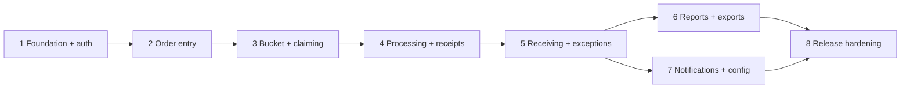

# Implementation roadmap

Phase 0 establishes decisions and the project scaffold only. Each later phase begins from the latest approved `main`, uses its dedicated branch, satisfies automated/manual acceptance criteria, and requires explicit approval before merge/deployment. A later phase must explain conflicts and propose the smallest safe correction rather than silently redesigning approved behavior.

## Dependency flow

## Phase 1 — Foundation, authentication, schema, authorization

Branch: `phase/1-foundation-auth`

Deliverables:

- Clerk invitation-only authentication and no public sign-up route.
- Convex project, schema, indexes, user synchronization, deactivation behavior.
- Central server authorization helpers and role/capability definitions.
- Hidden Overlord bootstrap, concealment, protected management surface boundary.
- Minimal authenticated shell, role-aware navigation, inactive/access-denied states.
- Append-only audit primitives and actor redaction.
- Vitest foundation and security/role tests; `.env.example` names only.

Dependencies/authorization: Clerk application and Convex project/deployments must be created or authorized by the owner. Decide exact supported Node version, Clerk webhook use, safe development-user strategy, attachment defaults, and Overlord recovery procedure.

Exit: invited active users can load the shell; backend rejects unauthorized/forged-role calls; concealment and audit tests pass; lint/types/tests/build pass.

## Phase 2 — Order creation, items, attachments, lead time

Branch: `phase/2-order-entry`

Deliverables:

- Administrative data for categories/rules, departments, and locations.
- Multi-step, accessible, responsive multi-item order form and draft workflow.
- Required order-level billing responsibility choice: client-billed or internal cost; client-billed orders capture and snapshot the required client reference.
- Server-authoritative calendar lead-time validation and exception routing.
- UTC/timezone and integer-minor-unit handling.
- Authorized Convex File Storage upload/finalization/access.
- My Orders/detail with ownership and on-behalf-of authorization.
- Tests for multi-item/category invariants, billing-responsibility validation and correction controls, time boundaries, files, IDOR, and timezone.

Dependencies: Phase 1 identity/schema/auth; approved initial editable sample data (Food Delivery one hour, Event Purchase three days); final attachment allowlist/limits can remain configuration but safe development defaults must be documented.

Exit: valid compliant and late orders follow distinct controlled paths; every submitted order has a valid billing responsibility and client-billed orders have a client reference; unauthorized reads/uploads or billing reclassification fail; full verification passes.

## Phase 3 — Purchasing bucket, atomic claiming, prioritization

Branch: `phase/3-purchasing-bucket`

Deliverables:

- Real-time bounded purchasing bucket, responsive table/cards, search and filters.
- Deterministic urgency ordering with stable tie-breaks.
- Atomic self-claim, self-release with reason, SA/Overlord reassignment with reason.
- Receptionist read-only assignment visibility.
- Concurrency, role, priority, real-time, and audit tests.

Dependencies: submitted orders, category/required time, centralized authorization, indexes, audit primitives.

Exit: exactly one concurrent claimant succeeds; all views update without refresh; permission and priority tests pass.

## Phase 4 — Processing, comments, purchases, receipts

Branch: `phase/4-processing-receipts`

Deliverables:

- Controlled order/item transition commands and assigned-agent workspace.
- Independent item progress, information requests, substitutions, unavailable/partial outcomes.
- Server-separated shared comments and internal notes.
- Purchase transactions, multi-item/multiple receipt relationships, proof requirements.
- Minor-unit cost summaries and derived order state.
- Billing-responsibility visibility in purchasing and financial summaries without implementing client invoicing or accounts receivable.
- Transition, visibility, receipt, reconciliation, authorization, and audit tests.

Dependencies: Phase 3 assignment ownership; Phase 2 files/items; approved transition matrix.

Exit: arbitrary states fail, financial totals reconcile, ordinary purchase cannot finalize without proof, and comment isolation holds.

## Phase 5 — Receiving, confirmations, changes, exceptions, cancellation

Branch: `phase/5-receiving-exceptions`

Deliverables:

- Full/partial receiving events and evidence.
- Requester confirmation and issue outcomes; privileged reasoned completion.
- Formal material change requests and configurable edit cutoff.
- Late/budget exception queues without invented thresholds.
- Direct/requested/post-purchase cancellation with item financial outcomes.
- Comprehensive boundary and history tests.

Dependencies: purchase/item states and audit; notification primitives may initially be in-app event records completed in Phase 7. Final post-purchase cancellation matrix and edit cutoffs remain configurable decisions.

Exit: ordinary completion requires confirmation, issues remain active, material changes/cancellations preserve history, and role boundaries pass.

## Phase 6 — Dashboard, reports, exports

Branch: `phase/6-reporting`

Deliverables:

- Authorized dashboards/filters using explicit operational date dimensions.
- Documented metric definitions, denominators, exclusions, timezone and partial/cancel behavior.
- Server-generated filtered CSV with formula-injection defense; XLSX only after dependency review.
- Overlord concealment throughout rows, filters, totals, and exports.
- Metric, date, reconciliation, access, redaction, and export tests.

Dependencies: stable operational/financial lifecycle through Phase 5 and report-supporting indexes.

Exit: reports are reproducible and accurately labeled; exports match filters and remain safe; hidden owner cannot be inferred.

## Phase 7 — Notifications and configurable administration

Branch: `phase/7-notifications-config`

Deliverables:

- Authorized, deduplicated in-app notifications and deep links.
- Audited settings for lead times, departments/cost centers, locations, receptionist transitions, cutoffs, and cancellation outcomes.
- Future budget-allocation management foundation explicitly marked unenforced.
- Recipient, authorization, deduplication, configuration, and audit tests.

Dependencies: stable event types from Phases 2–5 and authorization/config foundations. External email/Teams remains deferred.

Exit: notifications reveal only authorized data; operational policy changes do not require code; budgets are not falsely enforced.

## Phase 8 — Hardening, accessibility, CI/CD, release

Branch: `phase/8-release-hardening`

Deliverables:

- Function/file/export/route permission audit and Overlord discovery regression suite.
- WCAG 2.1 AA-oriented keyboard, focus, labels, announcements, contrast, errors, loading, and responsive review.
- GitHub Actions for clean install, formatting, lint, types, unit/integration, build; Playwright smoke flows.
- Query/index/performance and attachment/retention review.
- Deployment, rollback, release, admin, and user guides.
- Full release report with go/no-go recommendation and known limitations.

Dependencies/authorization: completed features, GitHub Actions permission, Vercel project/environment connection, production Clerk and Convex values, manual test users for each visible role, approved release/retention policies.

Exit: automated and required manual journeys pass, no known access bypass remains, documentation and rollback are operational, and production authorization is verified rather than assumed.

## Decisions that remain deferred

- Complete category list and lead times beyond editable examples.
- Department/user/event/cost-center budget policy, thresholds, consumption, and enforcement.
- Final post-purchase cancellation authority.
- Exact edit cutoff by status/category/time remaining.
- External email/Teams notifications and PDF leadership reports.
- Attachment/audit/financial retention details and optional malware scanning.

These are configuration or later approval gates. No implementation phase may silently select them.

## Phase 1 blockers and owner actions

There is no architectural blocker once Phase 0 is approved. Implementation requires the owner to authorize/create Clerk and Convex development resources and provide secret values through local/deployment secret stores, never chat, source, or committed files. Vercel authorization is not required until deployment work, though early preview setup may be chosen. Business decisions intentionally deferred above do not block Phase 1.
